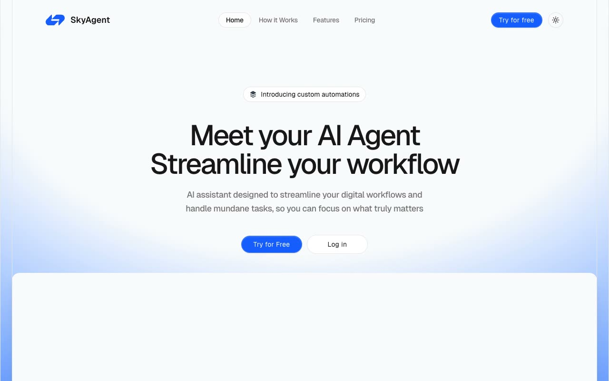

# SkyAgent SaaS Landing Page

[](./demo.mp4)

A self-contained implementation of the Magic UI SkyAgent marketing template. The responsive page includes a navigation drawer, theme control, workflow feature sections, secure growth visuals, monthly and yearly pricing, testimonials, FAQ accordions, and conversion sections.

## Run

Serve this folder with any static file server:

```sh
python3 -m http.server
```

Open the printed local URL in a browser.

## Verification

The audit evidence in `.audit/` covers the live reference and local page at 390, 768, and 1280 pixels. It also verifies the mobile menu, pricing period, workflow steps, FAQ expansion, dark theme, console output, and network requests.

## Reference

Original design: [Magic UI Agent](https://agent-magicui.vercel.app/)
