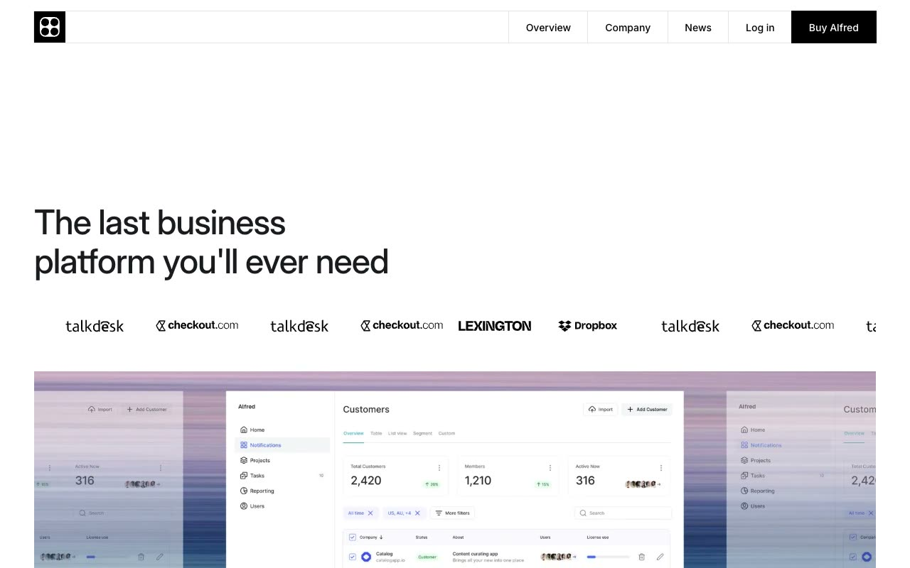

# Alfred — SaaS Productivity Platform Landing Page (Vanilla HTML + CSS + JS)

[](./demo.mp4)

Alfred is a pixel-faithful static clone of the Alfred premium Astro template by Lexington Themes, reproduced as plain HTML, CSS, and vanilla JavaScript with no build step required. It is a ten-page light-mode SaaS landing site for a fictional business productivity platform, covering a hero section with a dashboard screenshot and scrolling logo marquee, a blue collaboration section, a rose calendar feature section, a six-cell bento grid showcasing product tools, a four-tab feature showcase with a glass background image, a CTA section, a two-plan pricing page with FAQ accordion, an about page with CEO photo and quote overlay, a customers page with six colored brand cards, a changelog, a twenty-integration grid with fuzzy search modal, a help center, a ten-post blog grid, and sign-in and book-a-demo forms. The design uses Inter Variable for all text, an oklch white-and-gray palette with soft accent colors (blue, rose, green, teal, purple, yellow), square corners throughout, and a CSS marquee animation for scrolling logo strips. Nav dropdowns, flyout sub-menus, and the mobile hamburger are wired in vanilla JS; shared nav and footer are injected via a shared.js component pattern requiring no build step.

## Run

No build step is needed. Open `index.html` directly in a browser, or serve the folder with a local static server:

```sh
python3 -m http.server
```

Then visit `http://localhost:8000`.

## Pages

| File | Page |
|---|---|
| `index.html` | Home — hero, marquee, blue/rose feature sections, bento grid, feature tabs, CTA, footer |
| `pricing.html` | Pricing — Team ($49/m) and Enterprise plans with feature lists, FAQ accordion |
| `about.html` | About — CEO photo, mission statement, glass quote section, marquee |
| `customers.html` | Customers — six colored customer brand cards |
| `changelog.html` | Changelog — three versioned release entries |
| `integrations.html` | Integrations — twenty-card integration grid with fuzzy search modal |
| `helpcenter.html` | Help Center — four help article links, contact support CTA |
| `blog.html` | Blog — ten post cards with webp images |
| `signin.html` | Sign In — email input, Google sign-in |
| `bookdemo.html` | Book a Demo — multi-field contact form |

## Notable techniques

- **No dependencies** — nav interactions (dropdowns, flyout submenus, mobile toggle), tab switcher, search modal, and FAQ accordion all use vanilla JS. No framework or build step needed.
- **Shared nav/footer injection** — `assets/shared.js` exports `getHeader()` and `getFooter()` template strings, injected into `#nav-placeholder` and `#footer-placeholder` divs on `DOMContentLoaded`, so nav/footer are maintained in one place across all pages.
- **CSS marquee** — `@keyframes marquee-anim` translates a doubled image strip from `translateX(0)` to `translateX(-50%)` for seamless infinite loop.
- **oklch color tokens** — all palette values match Tailwind v4's oklch output; defined as CSS custom properties so the entire design is token-driven.
- **Feature tab switcher** — `.tab-btn.active` / `.tab-content.active` toggled with a single `switchTab()` function, no library needed.
- **Fuzzy search modal** — integrations page implements client-side substring search without FuseJS (the source used FuseJS; this clone uses a 20-line vanilla filter that covers the same use case).
- **Inter Variable** — single woff2 variable font covering weights 100–900, vendored locally under `assets/fonts/`.
- **Glass backgrounds** — CTA and about sections use `` absolutely positioned behind text with `object-fit: cover` for the frosted-glass look seen in the original.

`prompt.md` holds the full build specification and `demo.mp4` shows the template in motion.

## Credits

Faithful clone of an existing design, recreated for study/learning. All credit for the original design goes to its creators.

**Original:** Lexington Themes — https://lexingtonthemes.com/viewports/alfred

---

Part of the [Lexington Themes](../) provider collection inside [Templates](../../) in the [claude-directory](../../../../../).
