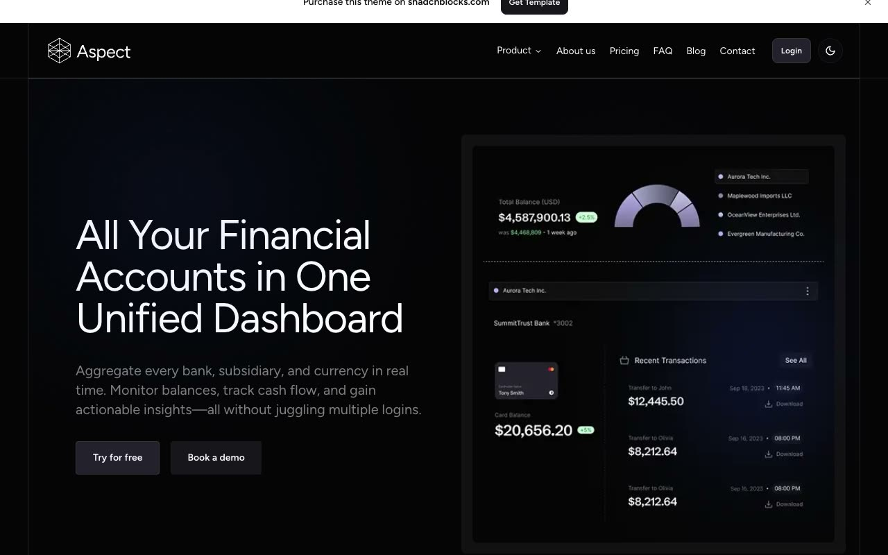

# Aspect Fintech Website

[](./demo.mp4)

A self-contained reproduction of the premium Aspect template from Shadcnblocks. The 17-page static site includes the dark-first financial dashboard aesthetic, responsive layouts, theme switching, navigation menus, feature tabs, accordions, billing controls, forms, blog pages, and legal pages.

## Run

Serve this directory with any static file server:

```sh
python3 -m http.server
```

Open <http://localhost:8000> in a browser. No build step or package installation is required.

## Reference

- [Aspect template listing](https://www.shadcnblocks.com/template/aspect)
- [Aspect live demo](https://aspect-nextjs-template.vercel.app/)
