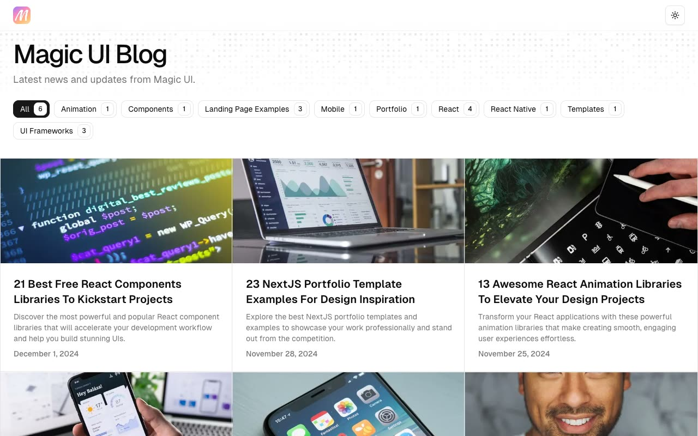

# Magic UI Blog

[](./demo.mp4)

A responsive editorial blog with a six-post index, desktop and mobile category filters, full article layouts, related posts, theme persistence, an animated canvas banner, and article navigation.

## Run

Serve the folder with any static web server:

```sh
python3 -m http.server 8000
```

Open `http://localhost:8000/index.html`. Article pages are under `blog/`.

## Reference

The visual reference is the [Magic UI Blog](https://blog-magicui.vercel.app/).
