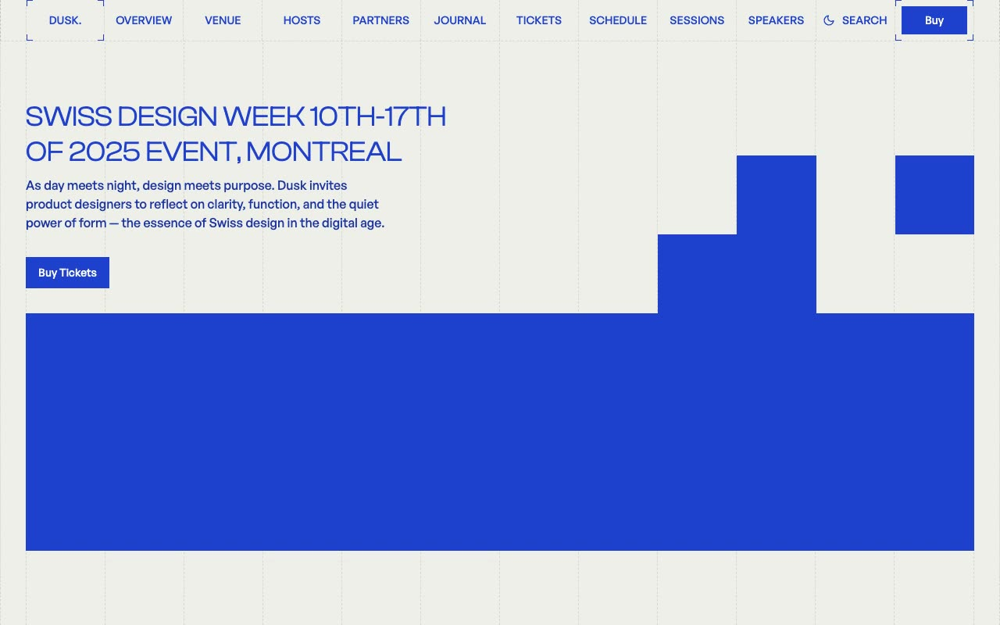

# Dusk: Swiss Design Conference Website Template

[](./demo.mp4)

Dusk is a 63-page conference and design-week template inspired by the International Typographic Style. It combines a warm canvas, electric blue accents, dashed grid dividers, oversized Clash Display headings, and compact General Sans body copy. The project includes marketing pages, schedules, sessions, speaker profiles, workshop details, sponsor pages, forms, a journal, tag archives, legal pages, and a design system.

## Run

Serve the project folder with a local static server.

```sh
python3 -m http.server 8000
```

## Key interactions

- **Search:** Search matches pages, posts, speakers, sessions, and sponsors.
- **Mobile menu:** Menu opens a full-screen responsive overlay that closes from its control or the Escape key.
- **FAQ:** Native disclosure elements reveal answers without a dependency.
- **Theme:** The navigation theme control persists the selected appearance in local storage.
- **Forms:** Registration, sign-in, and contact routes include complete responsive form layouts.

## Primary routes

- `index.html`
- `schedule.html`
- `sessions.html`
- `speakers.html`
- `tickets.html`
- `venue.html`
- `hosts.html`
- `partners.html`
- `sponsors.html`
- `gallery.html`
- `recap.html`
- `faq.html`
- `blog.html`
- `forms-register.html`
- `forms-sign-in.html`
- `forms-contact.html`

The remaining speaker, workshop, sponsor, journal, tag, legal, and system routes follow the same filename-based structure.

## Assets

Compiled styles, Clash Display and General Sans fonts, images, the favicon, and the search library are vendored under `assets/` for offline use.

## Credits

The original design is from [Lexington Themes](https://lexingtonthemes.com/viewports/dusk).

Part of the [Templates](../../README.md) collection.
