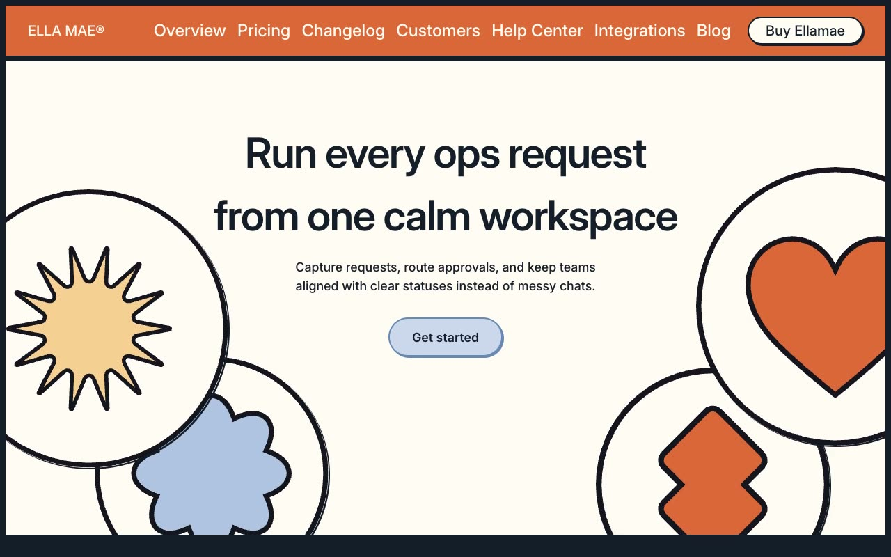

# Ella Mae®: SaaS Operations Workspace Website Template

[](./demo.mp4)

Ella Mae® is a 15-page operations workspace template with thick structural borders, pill-shaped controls, an animated logo marquee, native FAQ disclosures, responsive navigation, and a large footer wordmark. It is built with HTML, CSS, and JavaScript and requires no build step.

## Run

Serve the project folder with a local static server.

```sh
python3 -m http.server 8080
```

## Key interactions

- **Mobile navigation:** The menu control opens and closes the responsive navigation panel.
- **Blog search:** Search filters the available journal titles in a modal.
- **FAQ disclosures:** Questions expand to reveal their answers.
- **Forms:** Login, sign-up, contact, and newsletter forms use responsive input layouts.
- **Marquee:** The home page cycles partner logos continuously.

## Routes

- `index.html`
- `changelog/index.html`
- `customers/index.html`
- `helpcenter/index.html`
- `integrations/index.html`
- `blog/index.html`
- `system/overview/index.html`
- `system/buttons/index.html`
- `system/colors/index.html`
- `system/typography/index.html`
- `system/links/index.html`
- `forms/login/index.html`
- `forms/signup/index.html`
- `contact/index.html`
- `404.html`

## Credits

The original design is from [Lexington Themes](https://lexingtonthemes.com/viewports/ellamae).

Part of the [Templates](../../README.md) collection.
