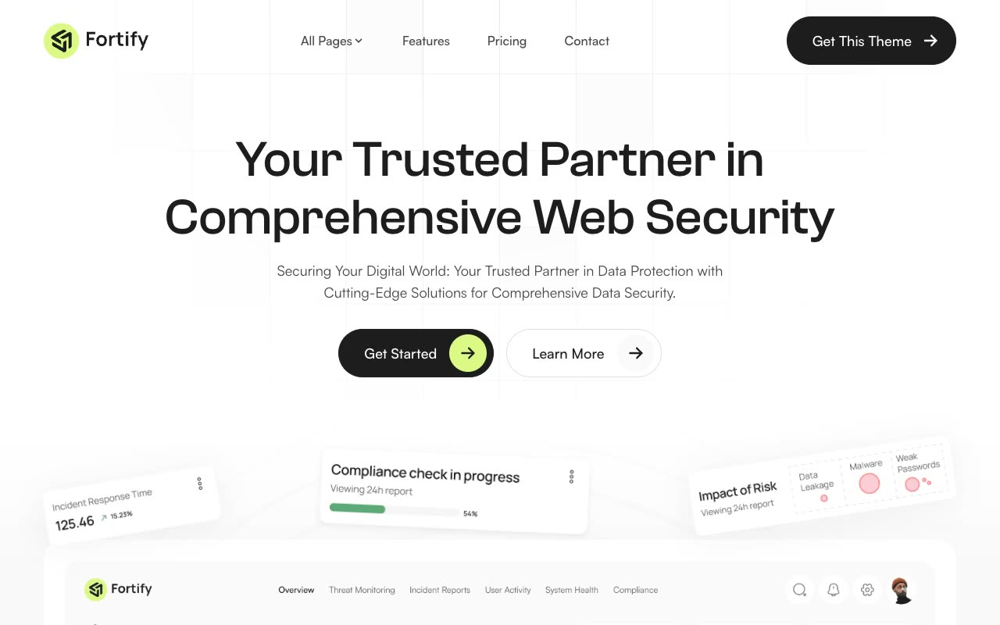

# Fortify Cybersecurity Template

[](./demo.mp4)

A faithful static reconstruction of the Themefisher Fortify NextJS template. The project preserves the live reference's complete content, lime and charcoal visual system, responsive layouts, and client-side interactions without requiring a build step.

## Pages

The project includes all 22 routes discovered on the live reference:

- Home, about, features, pricing, contact, integration, and reviews
- Blog listing, two pagination routes, and eight blog articles
- Changelog, elements, privacy policy, and terms and conditions

## Interactions

- Responsive navigation and page dropdown
- Monthly and yearly pricing
- FAQ and component accordions
- Component content tabs
- Embedded and native video controls

## Run

Serve the project directory with any static server:

```sh
python3 -m http.server
```

Then open `http://localhost:8000`.

## Reference

[Themefisher Fortify NextJS](https://themefisher.com/demo?theme=fortify-nextjs)
