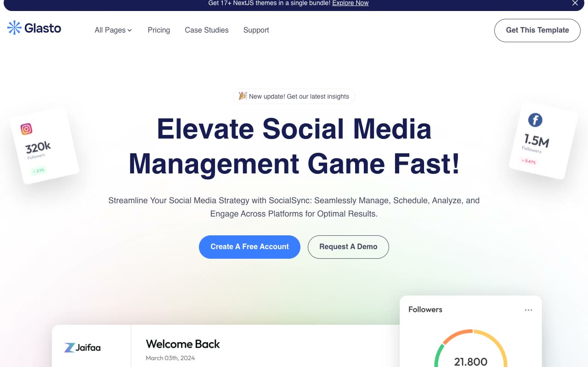

# Glasto SaaS Template

[](./demo.mp4)

A faithful static reconstruction of the Themefisher Glasto NextJS template. The project preserves the SocialSync content, blue and navy visual system, responsive layouts, and client-side interactions without requiring a build step.

## Pages

The project includes all 32 routes discovered on the live reference:

- Home, company, pricing, integration, contact, demo request, and reviews
- Case studies listing and eight case study details
- Blog listing, two pagination routes, and nine blog articles
- Changelog, elements, privacy policy, and terms and conditions

## Interactions

- Responsive navigation and page dropdown
- Dismissible announcement
- Monthly and yearly pricing
- Component tabs and accordions
- Embedded and native video controls

## Run

Serve the project directory with any static server:

```sh
python3 -m http.server
```

Then open `http://localhost:8000`.

## Reference

[Themefisher Glasto NextJS](https://themefisher.com/demo?theme=glasto-nextjs)
