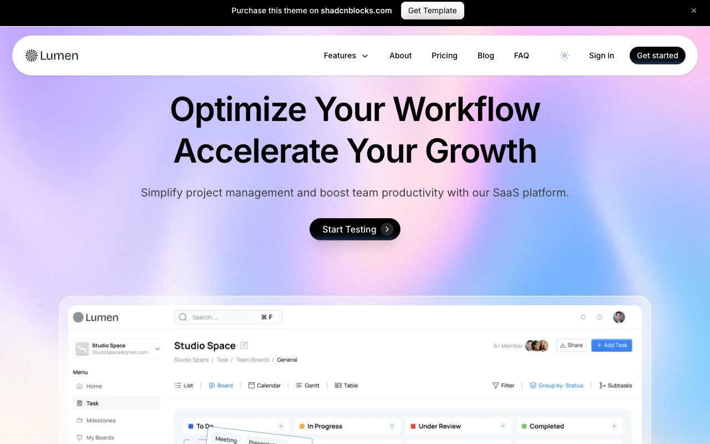

# Lumen SaaS Marketing Template

[](./demo.mp4)

A self-contained, pixel-faithful implementation of the Lumen SaaS marketing template in HTML, CSS, and JavaScript. The project includes 20 routes, local assets, responsive layouts, persistent light and dark themes, mobile navigation, banner dismissal, FAQ expansion, and monthly or annual pricing.

## Run

Serve the folder with any static HTTP server:

```sh
python3 -m http.server 8000
```

Open <http://localhost:8000/index.html>.

## Routes

- Home, About, Pricing, Blog, FAQ, Contact
- Sign in and Sign up
- Terms and Conditions and Privacy Policy
- Ten complete blog articles under `blog/`

The source Contact route currently renders the template's custom Page Not Found design, which is reproduced here.

## Reference

[Lumen by Shadcnblocks](https://www.shadcnblocks.com/template/lumen)
