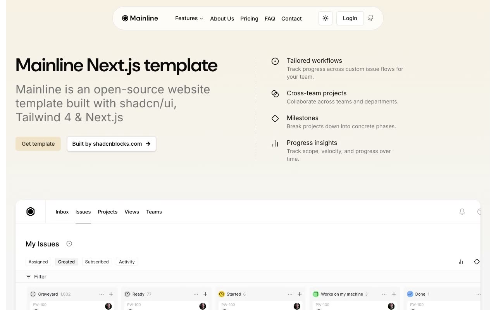

# Mainline SaaS Template

[](./demo.mp4)

Mainline is a static, pixel-matched recreation of the open-source Mainline product-management template. It preserves the warm neutral palette, floating navigation, responsive layouts, dark theme, pricing controls, accordions, carousel, mobile menu, and forms without requiring a build step.

## Pages

The eight audited routes are:

- `index.html`
- `about.html`
- `pricing.html`
- `faq.html`
- `contact.html`
- `login.html`
- `signup.html`
- `privacy.html`

Each route was checked at 390, 768, and 1280 pixels. Shared styling is in `reference.css`, and the interactive behavior is in `app.js`.

## Run locally

```sh
python3 -m http.server 8000
```

Open <http://localhost:8000/index.html>.

## Credit

Original design: [Mainline by shadcnblocks](https://www.shadcnblocks.com/template/mainline)

Live reference: [Mainline Next.js demo](https://mainline-nextjs-template.vercel.app/)
