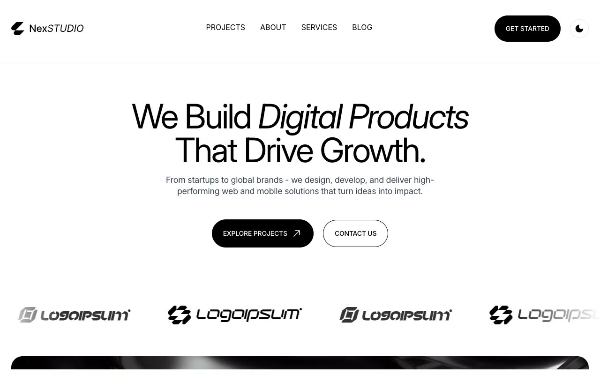

# NexStudio Creative Agency Template

[](./demo.mp4)

NexStudio is a responsive creative agency website built with HTML, CSS, and JavaScript. Its ten-page monochrome design includes persistent light and dark themes, accessible mobile navigation, motion effects, and a testimonial carousel.

## Pages

| File | Content |
| --- | --- |
| `index.html` | Landing page with services, work, testimonials, and articles |
| `about.html` | Agency story, mission, team, and values |
| `services.html` | Development, design, and support services |
| `portfolio.html` | Project gallery and category filters |
| `portfolio-detail-1.html` | First project case study |
| `portfolio-detail-2.html` | Second project case study |
| `blogs.html` | Article listing and categories |
| `blog-detail-1.html` | First long-form article |
| `blog-detail-2.html` | Second long-form article |
| `contact.html` | Contact form and office details |

## Run locally

```bash
python3 -m http.server 8080
```

Open `http://localhost:8080` in a browser.

## Reference

The visual reference is available at <https://nexstudio.demos.tailgrids.com/>.
