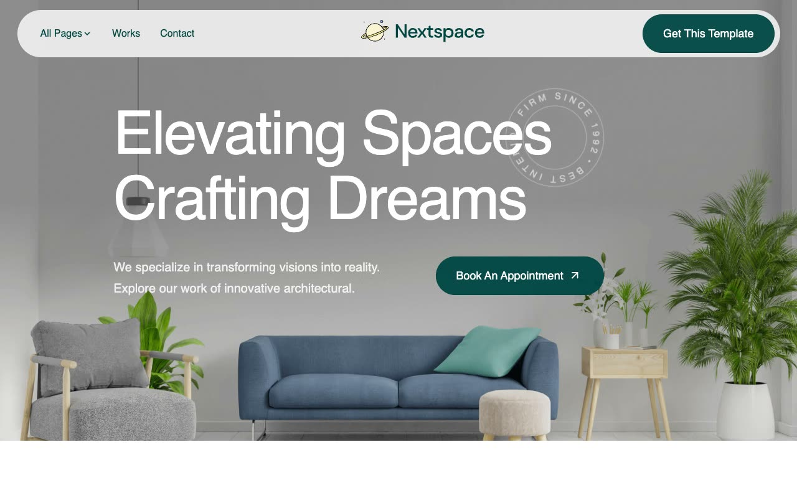

# Nextspace NextJS Template

[](./demo.mp4)

A static HTML reproduction of Themefisher's Nextspace NextJS template. The audited clone follows the complete live site across 30 routes with responsive architecture-studio layouts, scroll reveals, mobile navigation, FAQ accordions, sliders, forms, and design-system components.

## Routes

- Home, About, Services, Reviews, FAQs, Gallery, Contact, Career, Elements, Privacy, and Terms
- Projects index and seven project detail routes
- Blog index, pagination, and nine article routes

## Run locally

```sh
python3 -m http.server 8080
```

Open `http://localhost:8080`.

## Reference

[Themefisher Nextspace demo](https://nextspace-nextjs.vercel.app)
