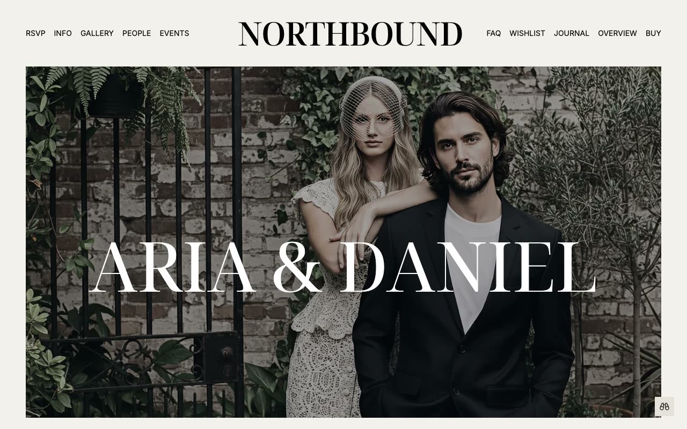

# Northbound: Wedding Website Template

[](./demo.mp4)

Northbound is a complete static HTML reproduction of the Northbound wedding website by Lexington Themes. Its editorial design combines expressive serif typography, restrained monochrome styling, full-bleed photography, and clear guest information.

The project contains all 70 pages currently reachable from the live reference, including the wedding overview, RSVP, guest information, galleries, wedding party profiles, events, wishlist items, journal posts, tag archives, locations, system guide, and not-found page.

## Page groups

- 9 primary pages
- 5 gallery albums
- 6 wedding party profiles
- 7 event details
- 9 wishlist item details
- 8 journal posts
- 19 journal tag pages
- 5 design system pages
- 2 location and utility pages

## Interactions

- Responsive mobile navigation
- Search modal with keyboard controls and real-time filtering
- RSVP form controls
- Image hover treatments and editorial transitions
- Responsive gallery and content layouts

## Run

Serve the project directory with any static file server:

```sh
python3 -m http.server 8080
```

Then open `http://localhost:8080`.

## Assets

The page markup and styles mirror the original deployment. Images, fonts, and supporting scripts load from the provider's published asset URLs.

## Credits

The original Northbound design is by [Lexington Themes](https://lexingtonthemes.com/viewports/northbound).
