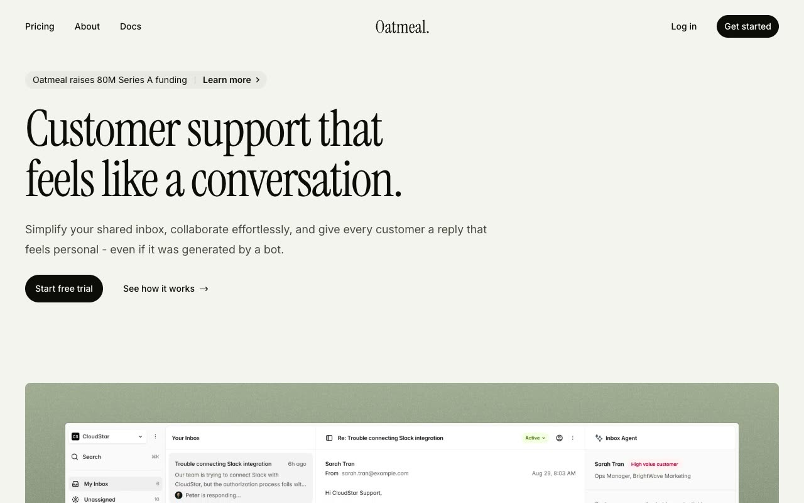

# Oatmeal SaaS Marketing Kit

[](./demo.mp4)

A self-contained recreation of the Tailwind Plus Oatmeal marketing kit in its olive and Instrument Serif theme. It includes 13 static pages with local fonts, images, and lightweight JavaScript interactions.

## Run

Serve the folder with any static web server:

```sh
python3 -m http.server 8000
```

Then open <http://localhost:8000/index.html>.

## Pages

- Three home layouts
- Three about layouts
- Three pricing layouts
- Two privacy policy layouts
- Two 404 layouts

## Features

- Responsive navigation with a modal mobile menu
- Accessible FAQ disclosures
- Monthly and yearly pricing tabs
- Keyboard navigation for pricing controls
- Click-to-copy installation command
- Local Inter and Instrument Serif fonts
- Vendored responsive image crops for offline use

## Reference

The original design is the [Tailwind Plus Oatmeal kit](https://tailwindcss.com/plus/kits/oatmeal/preview?theme=olive_instrument) by Tailwind Labs.
