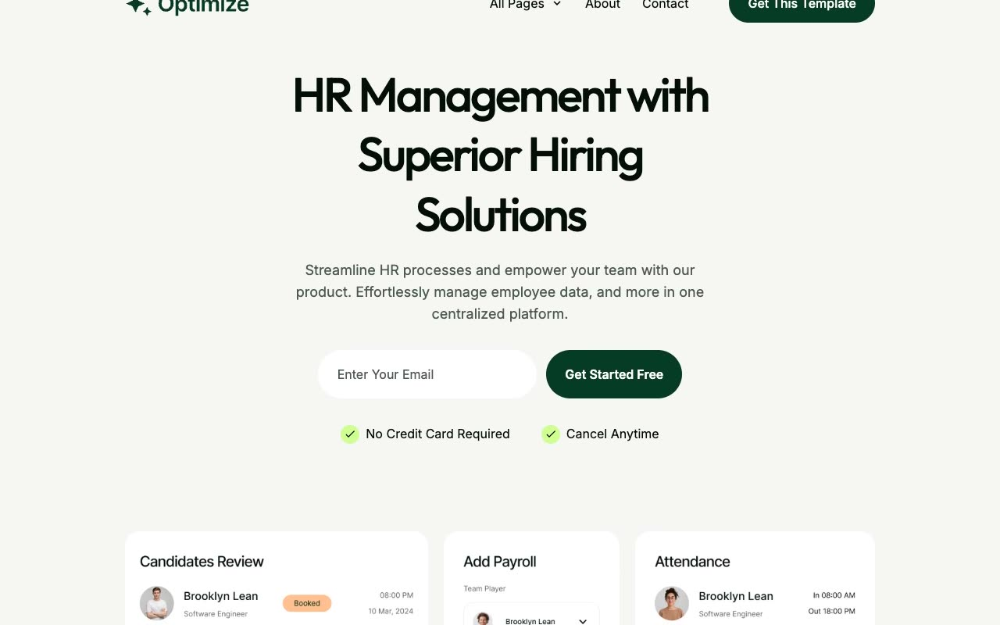

# Optimize HR SaaS Marketing Template

[](./demo.mp4)

Optimize is a static recreation of the Themefisher Optimize marketing site. It preserves the complete public design, responsive layouts, pricing controls, accordions, testimonial slider, forms, and motion details.

## Routes

The project contains 27 routes:

- Home, About, Features, Integrations, Pricing, Changelog, Contact, Book Demo, Elements, Privacy Policy, Terms, and 404
- Blog index with a second pagination route
- 13 individual blog posts

## Run locally

Serve this directory with any static file server:

```sh
python3 -m http.server
```

Then open `http://localhost:8000`.

## Verification

The `.audit` directory contains route, responsive screenshot, pixel similarity, and interaction verification evidence. The demo video and poster show the current implementation.

## Original design

[Themefisher Optimize demo](https://optimize-nextjs.vercel.app)
