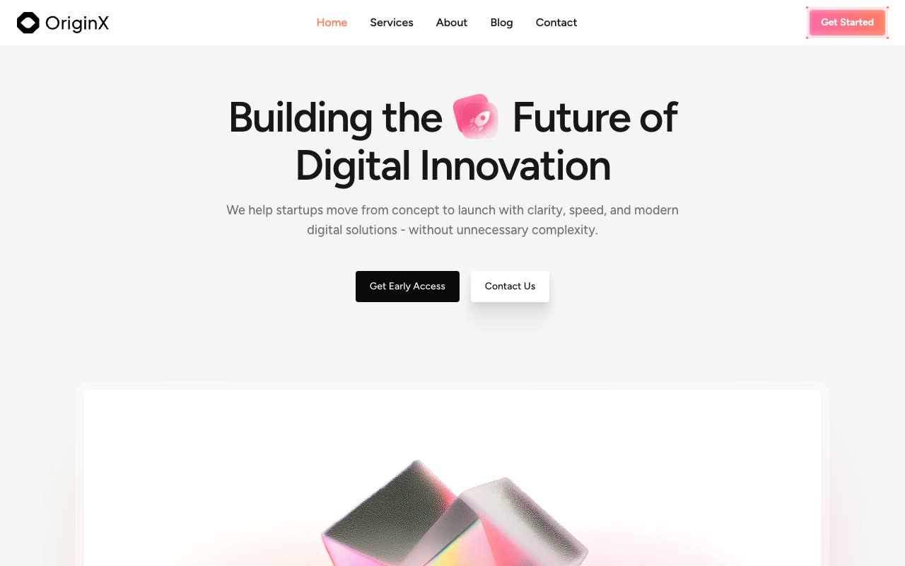

# Originx Startup Website Template

[](./demo.mp4)

Originx is a responsive startup and business website built with HTML, CSS, and JavaScript. It includes persistent light and dark themes, accessible mobile navigation, a testimonial carousel, FAQ accordions, scroll transitions, and responsive forms.

## Pages

| File | Content |
| --- | --- |
| `index.html` | Landing page with product features, testimonials, FAQs, and calls to action |
| `about.html` | Company story, mission, metrics, values, and team |
| `services.html` | Capabilities, workflow, and supporting product details |
| `blog.html` | Article listing and pagination |
| `blog-1.html` | Long-form article detail |
| `contact.html` | Contact form, support details, and office information |
| `signin.html` | Branded not-found fallback |
| `signup.html` | Branded not-found fallback |

## Run locally

```bash
python3 -m http.server 8080
```

Open `http://localhost:8080` in a browser.

## Reference

The visual reference is available at <https://originx.demos.tailgrids.com/>.
