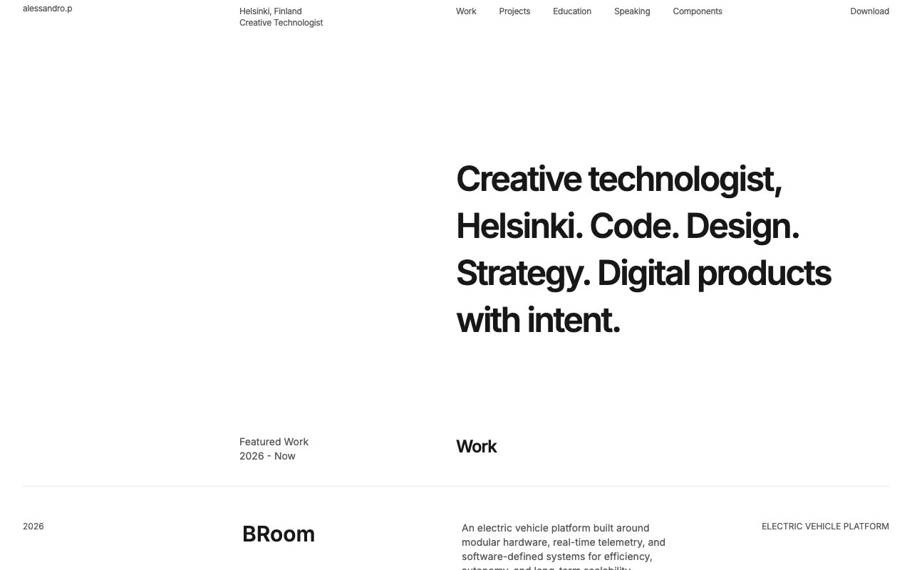

# Prima Persona: Personal Portfolio Template

[](./demo.mp4)

Prima Persona is a complete static HTML reproduction of the Prima Persona portfolio website by Lexington Themes. Its restrained single-page layout uses compact typography, generous whitespace, structured career content, and carefully composed project imagery.

The project contains all 7 pages currently reachable from the live reference: the portfolio, not-found page, and five design system pages.

## Interactions

- Smooth in-page navigation for work, projects, education, and speaking
- Responsive portfolio grids and project imagery
- Automatic light and dark color schemes
- Hover and focus treatments matching the original interface

## Run

Serve the project directory with any static file server:

```sh
python3 -m http.server 8080
```

Then open `http://localhost:8080`.

## Assets

The page markup and styles mirror the original deployment. Images and fonts load from the provider's published asset URLs.

## Credits

The original Prima Persona design is by [Lexington Themes](https://lexingtonthemes.com/viewports/primapersona).
