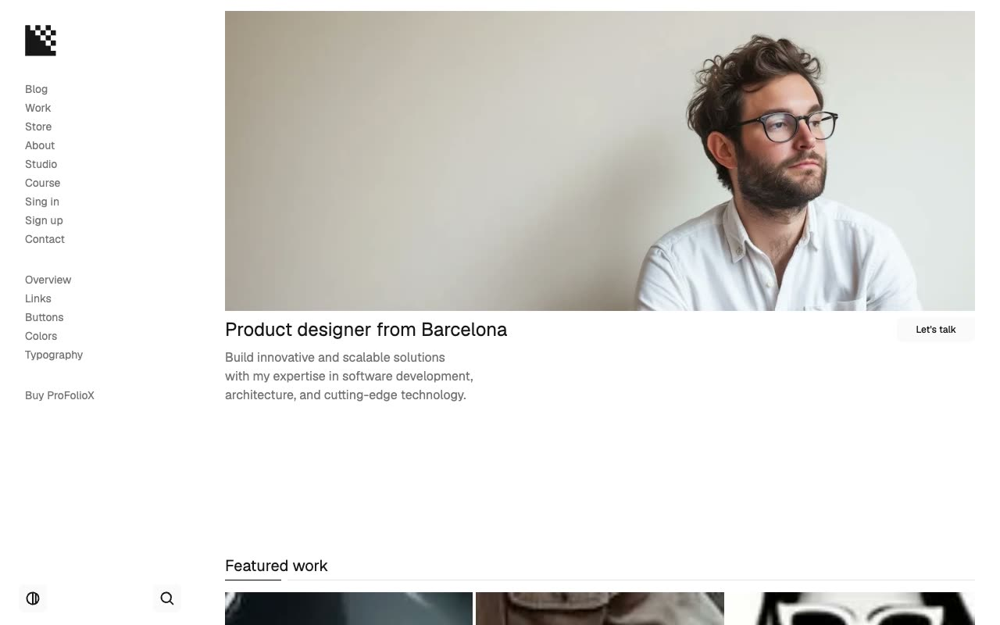

# ProFolioX Portfolio Template

[](./demo.mp4)

ProFolioX is a static reproduction of the current Lexington Themes portfolio template. It combines a fixed desktop sidebar, responsive mobile navigation, Geist typography, light and dark themes, animated project cards, searchable content, and editorial portfolio layouts.

The project contains all 48 HTML routes currently reachable from the live reference, including primary pages, collection pagination, blog posts, tag archives, work details, store products, account forms, and design system pages.

## Page groups

- 7 primary and account pages
- 3 blog listing pages
- 6 blog posts
- 7 blog tag pages
- 3 work listing pages
- 6 work details
- 4 store listing routes
- 6 store products
- 5 design system pages
- 1 not-found page

## Interactions

- Persistent light and dark themes
- Responsive mobile navigation
- Search modal with content filtering
- Animated navigation and scroll reveals
- Project, article, and product hover states
- Studio and course accordions

## Run

Serve the project directory with any static file server:

```sh
python3 -m http.server 8080
```

Then open `http://localhost:8080`.

## Assets

Page markup and styles mirror the current reference deployment. Fonts, images, and supporting scripts load from the provider's published asset URLs.

## Credits

The original ProFolioX design is by [Lexington Themes](https://lexingtonthemes.com/viewports/profoliox).
