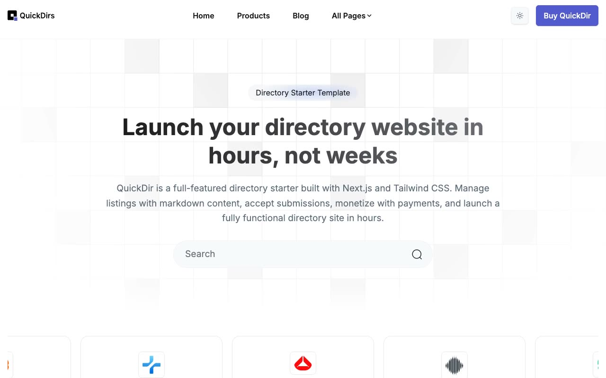

# Quickdir Directory Template

[](./demo.mp4)

Quickdir is a static recreation of the Themefisher Quickdir directory site. It preserves the complete public design, responsive layouts, navigation, search modal, testimonial controls, forms, and content routes.

## Routes

The project contains 42 routes:

- Home, About, Authors, Blog, Changelog, Contact, Docs, Pricing, Privacy Policy, Products, Submit, Terms and Conditions, and 404
- A second blog pagination route and five blog posts
- Three individual author pages
- 20 individual product listings

## Run locally

Serve this directory with any static file server:

```sh
python3 -m http.server
```

Then open `http://localhost:8000`.

## Verification

The `.audit` directory contains route, responsive screenshot, pixel similarity, and interaction verification evidence. The demo video and poster show the current implementation.

## Original design

[Themefisher Quickdir demo](https://quickdir-nextjs.vercel.app)
