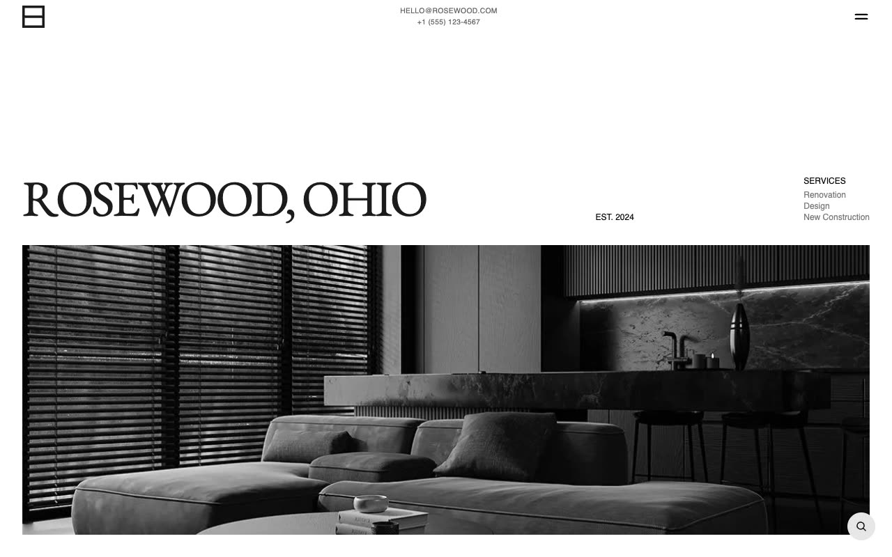

# Rosewood Home Renovation Template

[](./demo.mp4)

Rosewood is a static reproduction of a refined home renovation and construction website. The project contains all 53 HTML routes from the current reference, including service and project details, articles and tag archives, quote flows, legal pages, and system pages.

## Highlights

- Responsive layouts for mobile, tablet, and desktop viewports
- Full-screen mobile navigation and search overlay
- Interactive project category tabs
- Complete local route coverage with working internal links
- Refreshed demonstration video and poster image

## Run

Serve the directory with any static file server:

```sh
python3 -m http.server 8080
```

Then open `http://localhost:8080` in a browser.

## Assets

Page images and media are stored locally where practical. External font stylesheets and required browser libraries remain linked to their original public sources.

## Credits

The original Rosewood design is by [Lexington Themes](https://rosewood-astro.pages.dev/).
