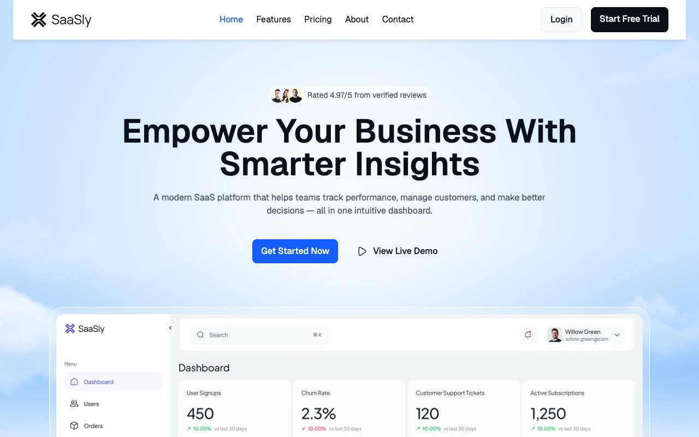

# Saasly Business SaaS Landing Page

[](./demo.mp4)

Saasly is a responsive, multi-page SaaS marketing template based on the TailGrids reference. It uses plain HTML, CSS, and JavaScript with locally hosted assets and no build step.

## Run

Serve the directory with any static web server:

```sh
python3 -m http.server 8080
```

Open `http://localhost:8080` in a browser.

## Pages

- Home
- Features
- Pricing
- About
- Contact

## Features

- Responsive desktop, tablet, and mobile layouts
- Mobile navigation with accessible expanded state
- Keyboard-accessible FAQ accordions
- Scroll-reactive header and entrance transitions
- Locally hosted fonts, images, logos, and interface assets

## Reference

The original design is available from [TailGrids](https://saasly.demos.tailgrids.com/).
