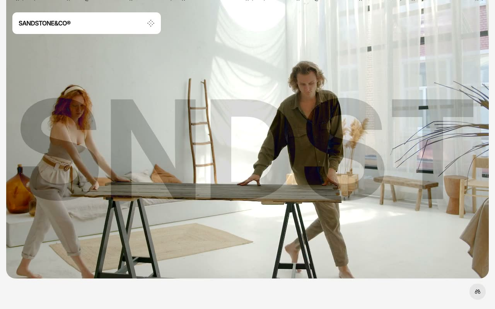

# Sandstone Interior Design Template

[](./demo.mp4)

Sandstone is a static reproduction of a contemporary interior design studio website. The project contains all 50 HTML routes from the current reference, including projects, services, articles and tag archives, team profiles, legal pages, and system pages.

## Highlights

- Responsive layouts for mobile, tablet, and desktop viewports
- Full-screen video hero with animated ticker and brand mark
- Expandable navigation and site search
- Interactive project carousels and service image switcher
- Complete local route coverage with working internal links
- Refreshed demonstration video and poster image

## Run

Serve the directory with any static file server:

```sh
python3 -m http.server 8080
```

Then open `http://localhost:8080` in a browser.

## Assets

Hero media and the existing project asset library are stored locally. Current reference images and required public browser libraries remain linked to their original sources where needed.

## Credits

The original Sandstone design is by [Lexington Themes](https://sandstone-astro.pages.dev/).
