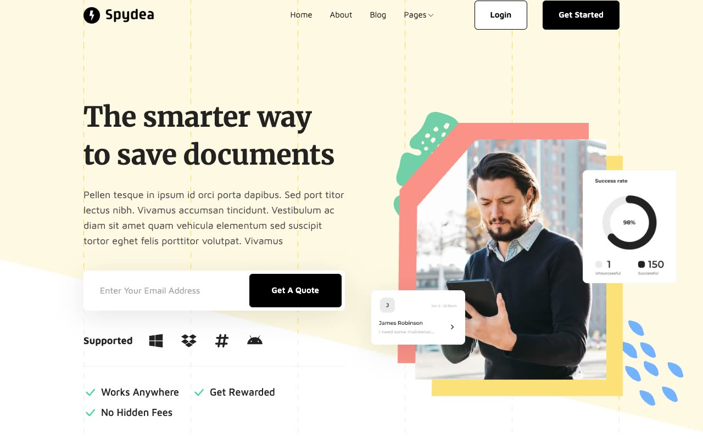

# Spydea Marketing Template

[](./demo.mp4)

Spydea is a static recreation of the Themefisher Spydea marketing site. It preserves the complete public design, responsive layouts, navigation, accordions, tabs, forms, counters, and content routes.

## Routes

The project contains 42 discoverable routes covering marketing pages, articles, authors, careers, integrations, account screens, pricing, legal content, and supporting pages.

## Run locally

```sh
python3 -m http.server
```

Then open `http://localhost:8000`.

## Verification

The `.audit` directory contains route, responsive screenshot, pixel similarity, and interaction verification evidence. The demo video and poster show the current implementation.

## Original design

[Themefisher Spydea demo](https://spydea-nextjs.vercel.app)
