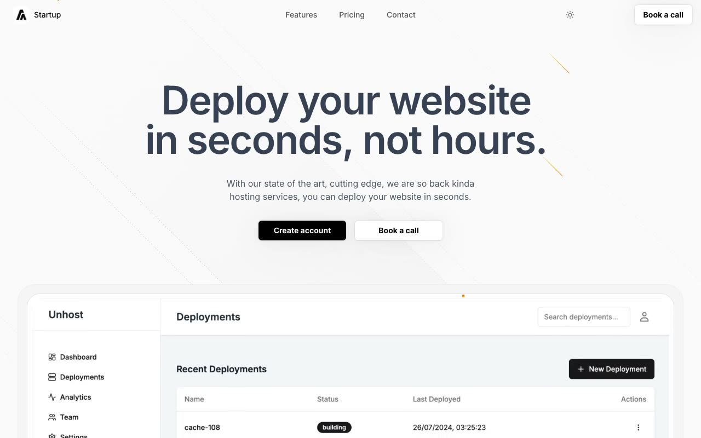

# Startup Landing Page Template

A responsive startup website reproduced from the Aceternity UI reference in static HTML, CSS, and JavaScript.

## Pages

- `index.html`: startup landing page
- `login.html`: account registration page

## Landing page sections

- Responsive navigation with theme control and mobile menu
- Hero with product dashboard
- Four-card feature grid
- Three-tier pricing table
- Customer call to action
- Multi-column footer

## Reference

[Aceternity UI startup landing page](https://ui.aceternity.com/template-preview/startup-landing-page-template)
