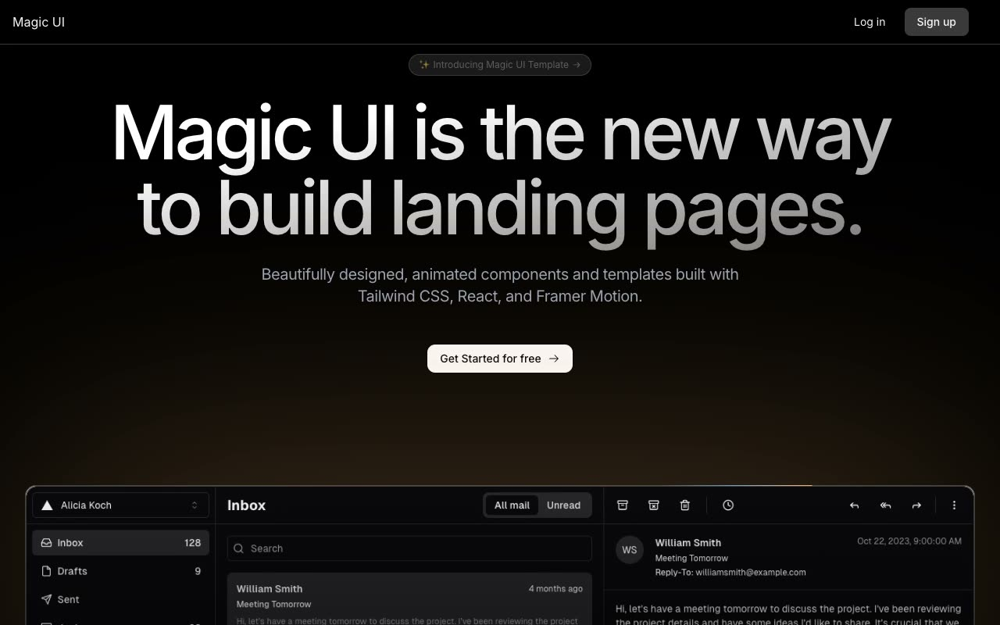

# Magic UI Startup template

[](./demo.mp4)

A responsive recreation of the Magic UI Startup template. It includes the complete marketing homepage, sign-in page, and sign-up page, with the live reference layout, typography, animation styling, mobile navigation, annual pricing, and working auth form states.

## Pages

- `index.html`: Marketing homepage
- `signin.html`: Sign-in page
- `signup.html`: Sign-up page

## Run locally

Serve this directory with any static web server, then open `index.html`.

```sh
python3 -m http.server 8000
```

The visual reference is the [Magic UI Startup template](https://startup-template-sage.vercel.app/).
