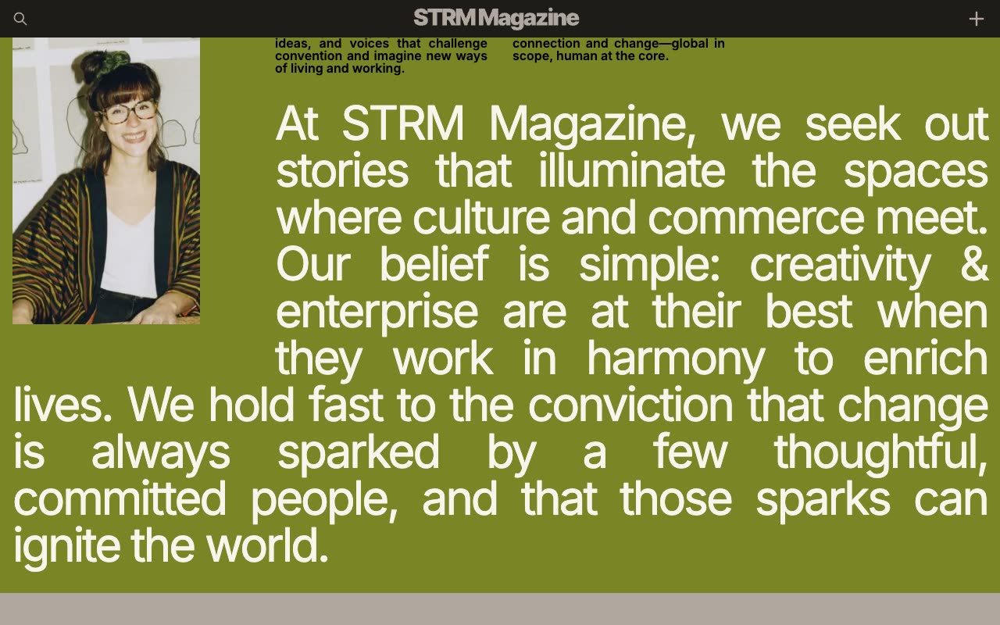

# Streamer Music and Media Template

[](./demo.mp4)

Streamer is a static reproduction of the current Lexington Themes music and media design. It includes all 103 discoverable routes as plain HTML, CSS, and JavaScript with no build step.

## Highlights

- Responsive editorial and audio layouts across mobile, tablet, and desktop widths
- Search modal, native details menu, ticker, and podcast player controls
- Article, author, tag, podcast, help center, jobs, pricing, account, legal, and system pages
- Local static routing with complete audit evidence in `.audit`

## Run

```sh
python3 -m http.server 8080
```

Open `http://localhost:8080` in a browser.

## Assets

- `demo.mp4` contains the current interaction recording
- `poster.jpg` is the generated demo poster
- `reference.css` contains the reproduced design styles

## Credits

The original Streamer design is by [Lexington Themes](https://streamer-astro-8r5.pages.dev/).
