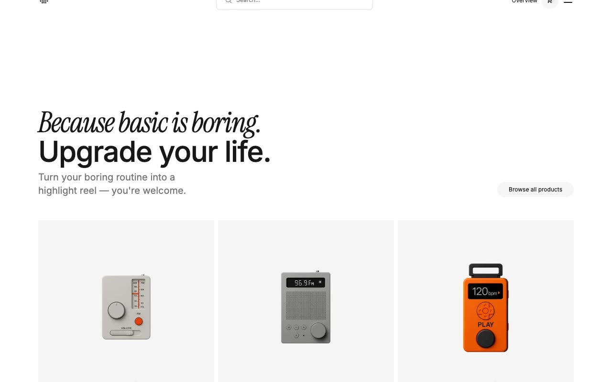

# Williamsburg Commerce Template

[](./demo.mp4)

Williamsburg is a static reproduction of the current Lexington Themes commerce and editorial design. It includes all 71 discoverable routes as plain HTML, CSS, and JavaScript with no build step.

## Highlights

- Responsive storefront, product, editorial, account, support, and system layouts across mobile, tablet, and desktop widths
- Search overlay, mobile navigation, tab navigation, and cart drawer interactions
- Product, store tag, blog, blog tag, help center, membership, affiliate, legal, and account pages
- Local static routing with complete audit evidence in `.audit`

## Run

```sh
python3 -m http.server 8080
```

Open `http://localhost:8080` in a browser.

## Assets

- `demo.mp4` contains the current interaction recording
- `poster.jpg` is the generated demo poster
- `reference.css` contains the reproduced design styles

## Credits

The original Williamsburg design is by [Lexington Themes](https://williamsburg-astro.pages.dev/).
