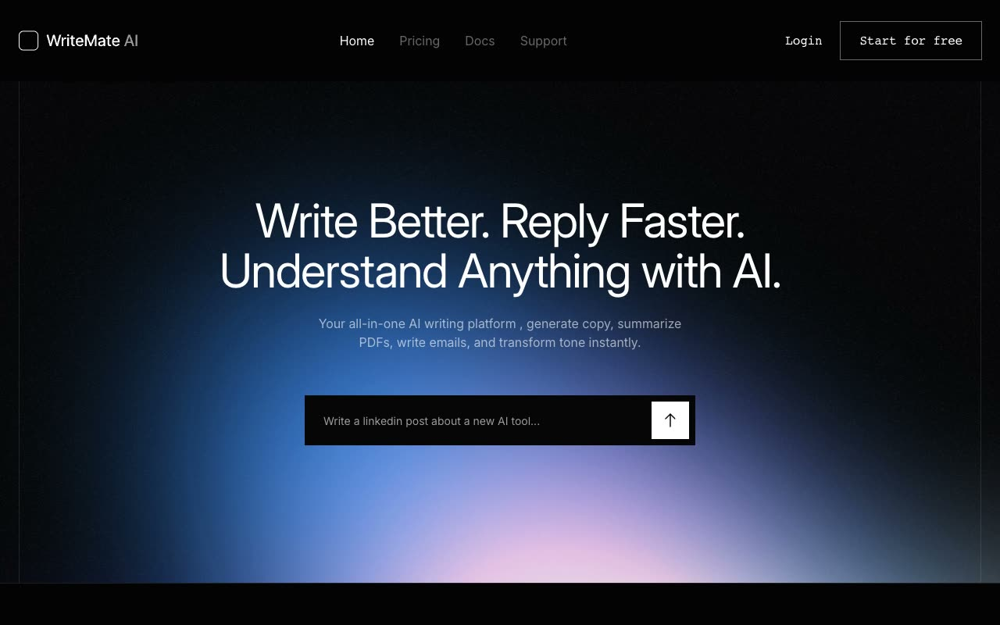

# Writemate AI Writing Landing Page Template

[](./demo.mp4)

Writemate is a responsive content creation and writing assistant landing page template based on the TailGrids reference design. It includes polished dark styling, translucent sticky navigation, local image assets, responsive carousels, accordion FAQs, and smooth interactive states.

## Run

Serve the directory with any static web server:

```sh
python3 -m http.server 8080
```

Then open `http://localhost:8080` in a web browser.

## Pages

- Home
- Pricing
- Docs
- Support
- Tools fallback page

## Features

- Responsive mobile navigation
- Accessible FAQ accordions
- Sticky header with scroll styling
- Touch and pointer carousel controls
- Locally stored fonts, graphics, and interface assets

## Reference

[TailGrids Writemate demo](https://writemate.demos.tailgrids.com/)
