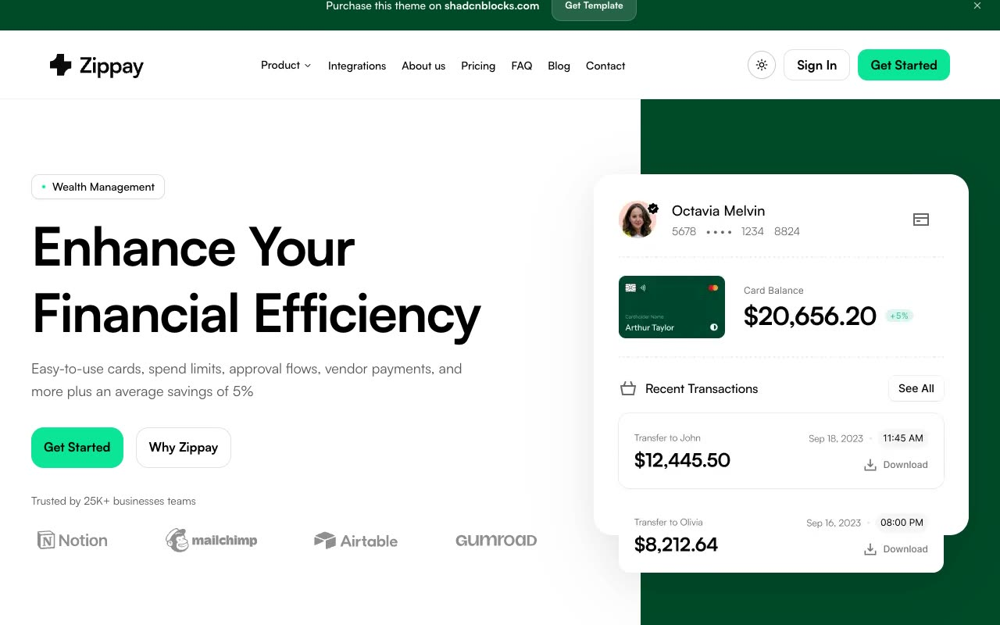

# Zippay

A faithful static reproduction of the Shadcnblocks Zippay template, including all 28 live routes, responsive layouts, theme controls, navigation, tabs, accordions, integration details, blog posts, and forms.

[](./demo.mp4)

## Run locally

Serve this directory with any static file server. For example:

```sh
python3 -m http.server 8000
```

Then open `http://localhost:8000`.
